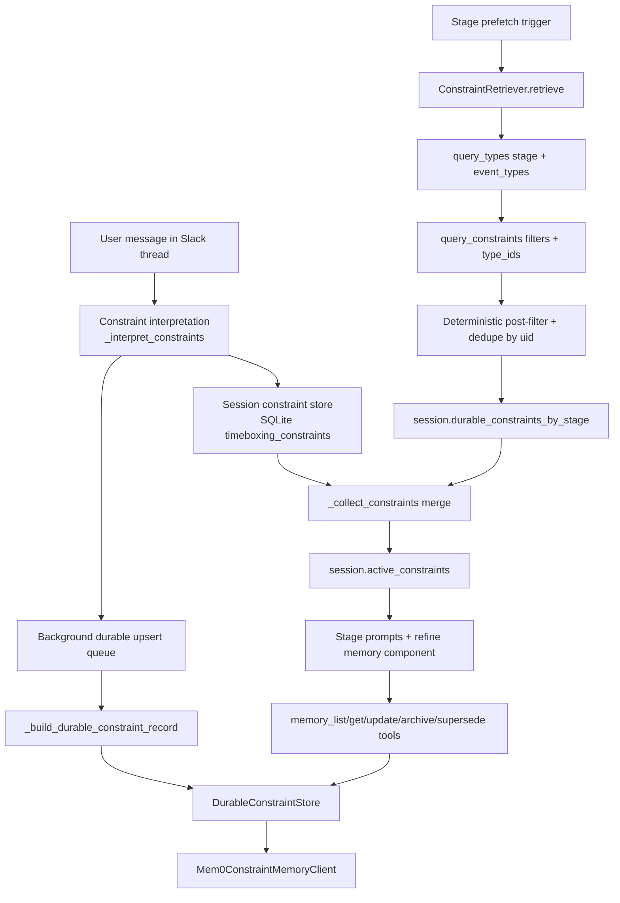

# Constraint Flow

This page documents the current Mem0-backed durable-constraint flow used by the timeboxing agent.

## End-to-End Flow



## Constraint Datamodel (Preserved)

The durable payload keeps the existing `constraint_record` shape:

1. Core fields: `name`, `description`, `necessity`, `status`, `source`, `scope`, `confidence`, `topics`
2. Applicability: `start_date`, `end_date`, `days_of_week`, `timezone`, `recurrence`
3. Payload: `rule_kind`, `scalar_params`, `windows`
4. Lifecycle: `uid`, `supersedes_uids`, `ttl_days`
5. Routing: `applies_stages`, `applies_event_types`

Mem0 metadata stores both the full `constraint_record` and flattened fields for filtering (`status`, `scope`, `type_id`, `topics`, stage/event lists, date bounds).

## Search and Selection

`ConstraintRetriever.retrieve(...)` builds a deterministic query plan from:

1. Stage (`COLLECT`, `SKELETON`, `REFINE`, ...)
2. Planned date (`as_of`)
3. Derived event types from immovables/block plan/frame facts

Then retrieval is:

1. `query_types(stage, event_types)` to rank candidate `type_id`s (skipped for Stage 1 startup prefetch)
2. `query_constraints(...)` with filters:
   - `as_of`
   - `stage`
   - `event_types_any`
   - `statuses_any = [locked, proposed]`
   - `require_active = true`
   - Stage 1 startup tag path: `tags=[startup_prefetch]`, `scopes_any=[profile, datespan]`
3. Mem0 client applies deterministic post-filtering + dedupe (latest `updated_at` per `uid`)
4. Results map into typed `Constraint` models and are merged with session-local constraints

## Updates and Extraction

Extraction/upsert is asynchronous and non-blocking:

1. User utterance is interpreted into structured constraints (`_interpret_constraints`)
2. Session constraints are written immediately to local SQLite for thread continuity
3. For `profile` / `datespan` scope, durable upsert is queued in background (`_queue_durable_constraint_upsert`)
4. Durable record mapping is deterministic (`_build_durable_constraint_record`) with stable UID generation
5. On success, stage prefetch cache is invalidated and refreshed

Stage 4/5 prioritization is explicit:

1. Patch tool first (`timebox_patch_and_sync`) when schedule change is requested
2. Memory CRUD tools are used for explicit review/edit requests
3. Background memory extraction still runs automatically and does not block patching

## Agent Tool Awareness

Stage 4/5 tool planner exposes durable-memory tools to the model:

1. `memory_list_constraints`
2. `memory_get_constraint`
3. `memory_update_constraint`
4. `memory_archive_constraint`
5. `memory_supersede_constraint`

This makes memory review/edit a first-class tool path, while extraction/upsert remains automatic in the background.

## Slack UX Path

Memory tool results are typed (`MemoryToolResult` / `MemoryConstraintItem`) and rendered for Slack:

1. Clear memory card summary
2. Top constraints preview rows
3. Per-row `Deny / Edit` button
4. `Review all constraints` action that opens a modal with full list
5. `needs_confirmation` indicator for low-confidence assumptions

## Migration

Runtime durable memory is Mem0-first.

If Notion source access is unavailable, use the temporary sqlite source fallback:

```bash
poetry run python scripts/migrate_notion_constraints_to_mem0.py --source sqlite --apply
```

This migrates local mirror rows from `timeboxing_constraints` into Mem0 while preserving the durable datamodel.
