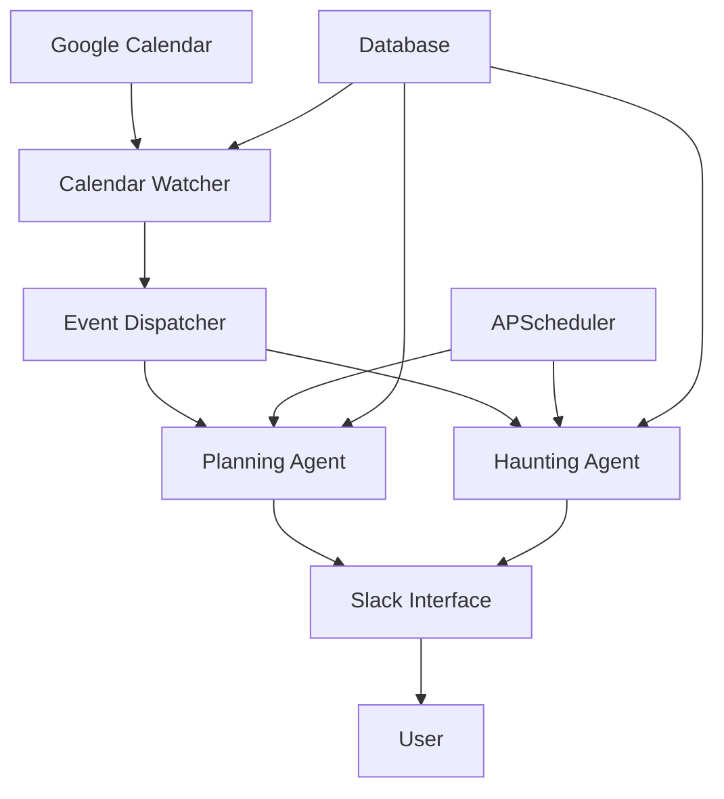

# Architecture Overview

The Admonish productivity system is built on a sophisticated **agentic AI framework** that actively manages your daily productivity rituals. Unlike passive productivity tools, Admonish ensures you maintain accountability through intelligent agents that monitor, prompt, and escalate when necessary.

## Core Principles

### 1. **Proactive Accountability**
The system doesn't wait for you to remember to plan - it actively ensures planning happens through scheduled interventions and escalating reminders.

### 2. **Event-Driven Architecture**
All system interactions are triggered by calendar events, user interactions, or scheduled jobs, creating a reactive system that responds to your actual behavior.

### 3. **Agent Specialization** 
Different agents handle specific aspects of productivity:
- **Planning Agent**: Ensures daily planning rituals
- **Haunting Agent**: Provides accountability and follow-up
- **Calendar Watcher**: Monitors calendar changes
- **Slack Interface**: Manages user interactions

### 4. **Persistent Context**
Each day's planning session maintains its own conversational context, allowing for rich, contextual interactions that build over time.

## System Components

## Data Flow

1. **Calendar Events** trigger the Calendar Watcher via webhooks
2. **Event Dispatcher** routes events to appropriate agents based on metadata
3. **Agents** process events and determine required actions
4. **Scheduler** manages time-based triggers and exponential backoff
5. **Slack Interface** provides rich user interactions
6. **Database** persists state, planning sessions, and agent context

## Key Technologies

- **AutoGen**: Powers intelligent agent decision-making
- **APScheduler**: Manages reliable job scheduling with persistence
- **SQLAlchemy**: Provides robust data modeling and persistence
- **Slack Bolt**: Enables rich interactive user experiences
- **MCP (Model Context Protocol)**: Integrates with Google Calendar
- **FastAPI**: Serves webhooks and API endpoints

## Agent Communication

Agents communicate through:

- **Shared Database State**: Planning sessions, event metadata, user preferences
- **Event Dispatching**: Reactive responses to calendar changes
- **Scheduled Jobs**: Time-based triggers with exponential backoff
- **Message Queues**: Asynchronous processing of user interactions

This architecture ensures that no planning ritual is missed while maintaining a responsive, intelligent user experience.
