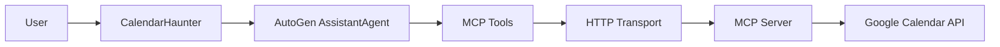

# Calendar Haunter

The Calendar Haunter provides AutoGen-powered Google Calendar integration for the FateForger system using the Model Context Protocol (MCP).

## Overview

The Calendar Haunter leverages:
- **AutoGen AssistantAgent**: Intelligent LLM-powered calendar assistant
- **MCP Protocol**: Secure, standardized calendar tool communication  
- **HTTP Transport**: Reliable connection bypassing broken SSE transport
- **Real Google Calendar API**: Access to actual calendar data via OAuth

## Architecture



## Key Features

### ✅ **Working Transport Solution**
- Uses `StreamableHttpServerParams` HTTP transport
- Bypasses broken SSE transport that hangs on `list_tools()`
- Reliable connection to MCP server

### 🤖 **AutoGen Integration** 
- Full `AssistantAgent` with GPT-4o-mini
- Natural language query processing
- Intelligent tool selection and usage

### 📅 **Complete Calendar Functionality**
- List calendars and events
- Search across calendar data
- Create new events
- Analyze schedule conflicts
- Weekly/monthly views

### 🛡️ **Production Ready**
- Comprehensive error handling
- Retry logic and timeouts
- Graceful degradation
- Extensive test coverage

## Quick Start

### 1. Environment Setup

```bash
export OPENAI_API_KEY="your-openai-api-key"
export MCP_CALENDAR_SERVER_URL="http://localhost:3000"
```

### 2. Start MCP Server

```bash
docker run -p 3000:3000 myorg/calendar-mcp:v1.4.8
```

### 3. Basic Usage

```python
from fateforger.agents.haunters import CalendarHaunter

# Create haunter (for Slack bot integration)
haunter = CalendarHaunter(
    session_id=123,
    slack=slack_client,
    scheduler=scheduler,
    channel="C123456"
)

# Get today's events
events = await haunter.get_todays_events()
print(events)

# Handle user queries
await haunter.handle_reply("What's my schedule this week?")
```

### 4. Standalone Agent

```python
from fateforger.agents.haunters.calendar import create_calendar_haunter_agent

# Create standalone agent
agent = await create_calendar_haunter_agent()

# Direct queries
from autogen_agentchat.messages import TextMessage
from autogen_core import CancellationToken

message = TextMessage("List my calendars", source="user")
response = await agent.on_messages([message], CancellationToken())
```

## API Reference

### CalendarHaunter Class

#### Core Methods

```python
async def ask_calendar_question(self, question: str) -> str:
    """Ask the calendar agent any natural language question."""

async def get_todays_events(self) -> str:
    """Get today's calendar events."""

async def get_weekly_schedule(self) -> str:
    """Get this week's calendar schedule."""

async def list_calendars(self) -> str:
    """List available Google calendars."""

async def search_events(self, query: str) -> str:
    """Search for events containing specific terms."""

async def create_event(self, title: str, start_time: str, description: Optional[str] = None) -> str:
    """Create a new calendar event."""

async def handle_reply(self, text: str) -> None:
    """Handle user replies via Slack integration."""
```

#### Example Queries

The agent handles natural language queries intelligently:

```python
# Time-based queries
await haunter.ask_calendar_question("What do I have tomorrow morning?")
await haunter.ask_calendar_question("Am I free next Friday at 3 PM?")
await haunter.ask_calendar_question("Show me next week's schedule")

# Search queries  
await haunter.ask_calendar_question("Find all meetings with John")
await haunter.ask_calendar_question("Any events about the product launch?")

# Analysis queries
await haunter.ask_calendar_question("What's my busiest day this week?")
await haunter.ask_calendar_question("How many hours of meetings do I have today?")

# Management queries
await haunter.ask_calendar_question("Create a team sync for Tuesday 2 PM")
await haunter.ask_calendar_question("Move my 3 PM meeting to 4 PM")
```

### Standalone Functions

```python
async def create_calendar_haunter_agent() -> AssistantAgent:
    """Create standalone AutoGen calendar agent for external use."""
```

## Configuration

### Environment Variables

| Variable | Default | Description |
|----------|---------|-------------|
| `OPENAI_API_KEY` | Required | OpenAI API key for GPT-4o-mini |
| `MCP_CALENDAR_SERVER_URL` | `http://localhost:3000` | MCP server endpoint |

### MCP Server Configuration

The calendar haunter requires a running MCP server with Google Calendar integration. The server must:

1. **Support HTTP transport** at `/list-tools` and `/call-tool` endpoints
2. **Have OAuth credentials** configured for Google Calendar API
3. **Provide 9 calendar tools**:
   - `list-calendars`: List available calendars
   - `list-events`: List events in date range
   - `search-events`: Search events by query
   - `get-event`: Get specific event details
   - `create-event`: Create new event
   - `update-event`: Modify existing event
   - `delete-event`: Remove event
   - `get-free-busy`: Check availability
   - `list-attendees`: Get event attendees

## Testing

### Unit Tests

```bash
# Run all calendar haunter tests
pytest tests/unit/test_calendar_haunter.py -v

# Run specific test categories
pytest tests/unit/test_calendar_haunter.py::TestCalendarHaunter -v
pytest tests/unit/test_calendar_haunter.py::TestCreateCalendarHaunterAgent -v
```

### Integration Tests

```bash
# Requires MCP server and API keys
export OPENAI_API_KEY="your-key"
export MCP_CALENDAR_SERVER_URL="http://localhost:3000"

pytest tests/integration/test_calendar_haunter_integration.py -v -m integration
```

### Manual Testing

```bash
# Run example script
python examples/calendar_haunter_example.py
```

## Troubleshooting

### Common Issues

#### 1. **MCP Server Connection Failed**

```
RuntimeError: Calendar haunter initialization failed: No tools loaded from MCP server
```

**Solutions:**
- Verify MCP server is running: `curl http://localhost:3000/list-tools`
- Check server logs for authentication issues
- Ensure OAuth credentials are configured

#### 2. **SSE Transport Hanging**

The calendar haunter automatically uses HTTP transport to avoid SSE hanging issues. If you see timeouts, verify:
- MCP server supports HTTP endpoints
- Server responds to `/list-tools` and `/call-tool`

#### 3. **OpenAI API Errors**

```
RuntimeError: OpenAI API key not configured
```

**Solutions:**
- Set `OPENAI_API_KEY` environment variable
- Verify API key is valid and has credits
- Check OpenAI service status

#### 4. **Google Calendar Permissions**

If calendar queries return empty results:
- Verify OAuth scopes include calendar read/write
- Check Google Calendar API is enabled
- Ensure calendar is not hidden or restricted

### Debug Mode

Enable detailed logging:

```python
import logging
logging.basicConfig(level=logging.DEBUG)

# Calendar haunter will log all MCP communication
haunter = CalendarHaunter(...)
```

### Health Check

Test MCP server connectivity:

```bash
# Check server is responding
curl -X GET http://localhost:3000/list-tools

# Expected response: JSON array of 9 calendar tools
```

## Development

### Adding New Features

1. **Extend CalendarHaunter class** with new methods
2. **Add corresponding tests** in `test_calendar_haunter.py`  
3. **Update documentation** with new functionality
4. **Add integration tests** if external dependencies involved

### Code Standards

- **Type hints required** for all public methods
- **Async/await patterns** for all I/O operations
- **Error handling** with informative messages
- **Logging** for debugging and monitoring
- **Test coverage** minimum 90% for new features

## Performance Considerations

### Response Times
- **Agent initialization**: ~5-10 seconds (cached after first use)
- **Simple queries**: ~2-5 seconds  
- **Complex queries**: ~5-15 seconds
- **Calendar operations**: ~3-8 seconds

### Optimization Tips
- **Cache agent instance** - initialization is expensive
- **Use specific queries** - reduces processing time  
- **Implement timeouts** - prevent hanging requests
- **Monitor API usage** - OpenAI rate limits apply

## Security

### Best Practices
- **Environment variables** for all secrets
- **OAuth tokens** managed by MCP server
- **Network isolation** for production deployments
- **Rate limiting** on user queries

### Data Privacy
- **No calendar data stored** in FateForger
- **Queries logged** for debugging (disable in production)
- **Google Calendar permissions** follow least-privilege principle

## Integration Examples

### Slack Bot Integration

```python
@app.event("message")
async def handle_message(event, say):
    if "calendar" in event.get("text", "").lower():
        haunter = get_calendar_haunter(event["user"])
        response = await haunter.handle_reply(event["text"])
        await say(response)
```

### Scheduled Notifications

```python
@scheduler.scheduled_job("cron", hour=8, minute=0)  # 8 AM daily
async def morning_schedule():
    haunter = get_calendar_haunter(user_id)
    schedule = await haunter.get_todays_events()
    await send_notification(f"📅 Today's Schedule:\n{schedule}")
```

### REST API Integration

```python
@app.post("/calendar/query")
async def calendar_query(request: CalendarQuery):
    haunter = get_calendar_haunter(request.user_id)
    response = await haunter.ask_calendar_question(request.query)
    return {"response": response}
```

## Roadmap

### Planned Features
- [ ] **Multi-calendar support** - Handle multiple Google accounts
- [ ] **Recurring event patterns** - Smart recurring event creation
- [ ] **Meeting analytics** - Time spent in meetings analysis
- [ ] **Calendar optimization** - Suggest better scheduling
- [ ] **Integration with other calendars** - Outlook, Apple Calendar
- [ ] **Voice query support** - Process voice-to-text calendar queries

### Performance Improvements  
- [ ] **Response caching** - Cache frequent queries
- [ ] **Parallel processing** - Multiple queries simultaneously  
- [ ] **Request batching** - Combine multiple operations
- [ ] **Smart prefetching** - Anticipate common queries

## Contributing

1. **Fork the repository**
2. **Create feature branch**: `git checkout -b feature/calendar-enhancement`
3. **Add tests** for new functionality
4. **Update documentation** 
5. **Submit pull request** with clear description

### Development Setup

```bash
# Install dependencies
poetry install

# Run tests
poetry run pytest

# Type checking
poetry run mypy fateforger/agents/haunters/calendar.py

# Code formatting
poetry run black fateforger/agents/haunters/calendar.py
```
