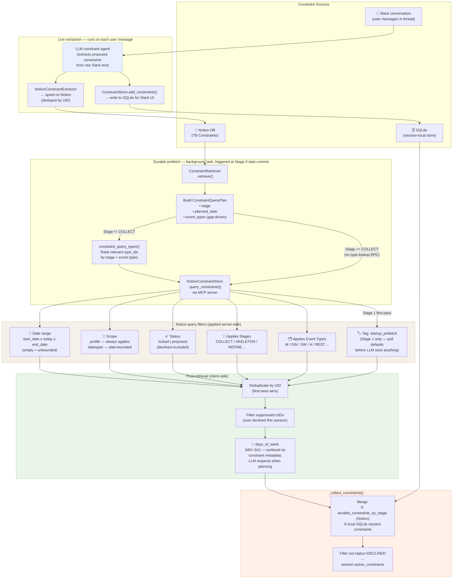

```mermaid
flowchart TD
    subgraph SOURCES["Constraint Sources"]
        direction TB
        SLACK["💬 Slack conversation\n(user messages in thread)"]
        NOTION["📓 Notion DB\n(TB Constraints)"]
        SQLITE["🗄️ SQLite\n(session-local store)"]
    end

    subgraph EXTRACTION["Live extraction — runs on each user message"]
        EXTRACT_AGENT["LLM constraint agent\n(extracts proposed constraints\nfrom raw Slack text)"]
        UPSERT["NotionConstraintExtractor\n→ upsert to Notion\n(deduped by UID)"]
        SQLITE_WRITE["ConstraintStore.add_constraints()\n→ write to SQLite for Slack UI"]
    end

    subgraph PREFETCH["Durable prefetch — background task, triggered at Stage 0 date-commit"]
        RETRIEVER["ConstraintRetriever\n.retrieve()"]
        PLAN["Build ConstraintQueryPlan\n• stage\n• planned_date\n• event_types (gap-driven)"]
        TYPE_LOOKUP["constraint_query_types()\nRank relevant type_ids\nby stage + event types"]
        NOTION_QUERY["NotionConstraintStore\n.query_constraints()\nvia MCP server"]
    end

    subgraph FILTERS["Notion query filters (applied server-side)"]
        DATE_RANGE["📅 Date range\nstart_date ≤ today ≤ end_date\n(empty = unbounded)"]
        SCOPE["🔭 Scope\nprofile  — always applies\ndatespan — date-bounded"]
        STATUS_F["✅ Status\nlocked | proposed\n(declined excluded)"]
        STAGE_F["🎯 Applies Stages\nCOLLECT / SKELETON / REFINE…"]
        EVENT_F["🗂️ Applies Event Types\nM / DW / SW / H / REST…"]
        STARTUP_TAG["🏷️ Tag: startup_prefetch\n(Stage 1 only — pull defaults\nbefore LLM sees anything)"]
    end

    subgraph POSTPROCESS["Post-retrieval (client-side)"]
        DAYS_DOW["📆 days_of_week\n(MO–SU) — surfaced as\nconstraint metadata;\nLLM respects when planning"]
        DEDUP["Deduplicate by UID\n(first-seen wins)"]
        SUPPRESS["Filter suppressed UIDs\n(user declined this session)"]
    end

    subgraph COLLECT["_collect_constraints()"]
        MERGE["Merge:\n① durable_constraints_by_stage (Notion)\n② local SQLite session constraints"]
        ACTIVE["Filter out status=DECLINED\n→ session.active_constraints"]
    end

    SLACK --> EXTRACT_AGENT
    EXTRACT_AGENT --> UPSERT
    UPSERT --> NOTION
    EXTRACT_AGENT --> SQLITE_WRITE
    SQLITE_WRITE --> SQLITE

    NOTION --> RETRIEVER
    RETRIEVER --> PLAN
    PLAN -->|"Stage != COLLECT"| TYPE_LOOKUP
    TYPE_LOOKUP --> NOTION_QUERY
    PLAN -->|"Stage == COLLECT\n(no type-lookup RPC)"| NOTION_QUERY

    NOTION_QUERY --> DATE_RANGE
    NOTION_QUERY --> SCOPE
    NOTION_QUERY --> STATUS_F
    NOTION_QUERY --> STAGE_F
    NOTION_QUERY --> EVENT_F
    NOTION_QUERY -->|"Stage 1 first pass"| STARTUP_TAG

    DATE_RANGE & SCOPE & STATUS_F & STAGE_F & EVENT_F --> DEDUP
    STARTUP_TAG --> DEDUP
    DEDUP --> SUPPRESS
    SUPPRESS --> DAYS_DOW

    DAYS_DOW --> MERGE
    SQLITE --> MERGE
    MERGE --> ACTIVE

    style FILTERS fill:#f5f0e8,stroke:#c8b89a
    style POSTPROCESS fill:#e8f5e8,stroke:#9ac89a
    style EXTRACT_AGENT fill:#e8f0ff,stroke:#9ab0e8
    style COLLECT fill:#fff0e8,stroke:#e8b89a
```