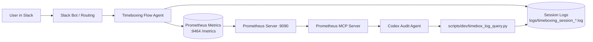
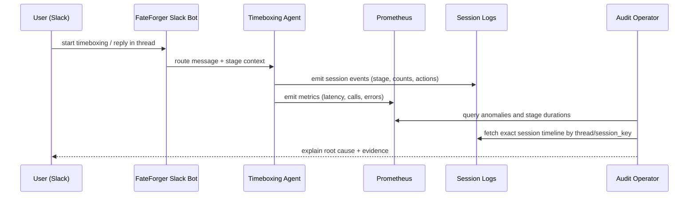

# From "167 Active Constraints?!" to Root Cause

A 3-part field guide to auditing FateForger with Prometheus, session logs, and Slack-driven agent workflows.

---

## Part I. The Session: What Actually Happened

### Context

FateForger is an agentic productivity system that runs planning, task orchestration, and scheduling workflows across Slack, calendar integrations, and durable memory.

In this session, the user asked why a timeboxing run suddenly reported **167 active constraints**, and then appeared to show only **6** constraints after a reply.

### The exact timeline (latest audited run)

- Session key / thread: `1772663759.082919`
- Planned day: `2026-03-05`
- Log file: `logs/timeboxing_session_20260304_223559_1772663759.082919_72353.log`

Observed events:

1. Initial active snapshot reached **167**:
   - `local_count=651`
   - `local_shared_scope_count=651`
   - `active_count=167`
2. User replied with day details.
3. Extraction step found **6** new constraints from that reply (`extracted_count=6`).
4. Next active snapshot became **173**, not 6.

So the system did **not** drop 161 constraints. It added 6 session constraints to an already large active pool.

### Why the numbers looked contradictory

Two counters were being read as if they were the same metric:

- **"extracted_count=6"** = new constraints derived from the latest message
- **"active_count=173"** = currently active merged set used by the stage

The UX path can surface "newly extracted" review blocks and compact "top N" views, which makes it easy to infer that total active constraints collapsed to 6.

### Root cause summary

The high active total came from shared-scope accumulation and filtering semantics:

- Session collection includes shared `PROFILE` and `DATESPAN` constraints across threads.
- The local pool was very large (`651` rows in this run before dedupe/filtering).
- Historical shared constraints were re-seen over many runs.
- Applicability-by-day (for user-facing totals) was not the same as "all currently merged active".

A direct DB audit for this session scope showed:

- Selected rows (thread + shared scopes): `658`
- Deduped active rows: `174`
- Profile/datespan active applicable on `2026-03-05`: `85`

That explains why the user-visible "all active" concept felt inflated relative to what should matter for this day.

---

## Part II. How the Observability Setup Works End-to-End

### What FateForger is instrumenting

FateForger emits observability signals for:

- LLM call volume/status/tokens
- Tool call volume/status
- Error counters by component/type
- Stage duration histograms
- Session-level structured event logs (JSON-style lines)

### Stack topology



### Wireframe: operator view during incident triage

```text
+--------------------------------------------------------------------------------+
| INCIDENT PANEL: "167 constraints"                                             |
+--------------------------------------------------------------------------------+
| 1) Metrics Health                                                              |
|    up{job="fateforger_app"} = 1                                               |
|    error_rate(60m) = 0                                                         |
|                                                                                |
| 2) Session Locator                                                             |
|    latest session_key = 1772663759.082919                                     |
|    log = logs/timeboxing_session_20260304_223559_...                          |
|                                                                                |
| 3) Timeline                                                                    |
|    active_count: 167 -> extracted_count: 6 -> active_count: 173               |
|                                                                                |
| 4) Diagnosis                                                                    |
|    shared PROFILE/DATESPAN constraints + compact UI display mismatch           |
+--------------------------------------------------------------------------------+
```

### How to hook in (practical steps)

1. Start observability stack:
   - `docker compose -f observability/docker-compose.yml up -d`
2. Ensure metrics endpoint is enabled in app env:
   - `OBS_PROMETHEUS_ENABLED=1`
   - `OBS_PROMETHEUS_PORT=9464`
3. Confirm scrape health:
   - PromQL: `up{job="fateforger_app"}` should be `1`
4. Detect anomalies with Prometheus first:
   - `sum by (component,error_type) (increase(fateforger_errors_total[60m]))`
   - `sum by (call_label,model,status) (increase(fateforger_llm_calls_total[60m]))`
   - `histogram_quantile(0.95, sum(rate(fateforger_stage_duration_seconds_bucket[60m])) by (le,stage))`
5. Pivot to payload-level diagnosis with logs:
   - `poetry run python scripts/dev/timebox_log_query.py sessions --limit 30`
   - `poetry run python scripts/dev/timebox_log_query.py events --session-key <key> --limit 500`

### Why this setup is effective

It cleanly separates concerns:

- **Prometheus** answers "is something wrong, where, and how often?"
- **Session logs** answer "what exactly happened for this user/thread/stage?"

This is the key reason we could resolve "167 vs 6" quickly without guessing.

---

## Part III. Slack-First Auditing with Workflow-Supporting Agents

FateForger is not just a backend. The real operational surface is Slack, where the user and agents run a staged conversation.

### Agent roles in audit context

- **TaskMarshal**: intake/routing/orchestration context
- **Timeboxing flow**: staged planning decisions and constraint handling
- **Schedular**: plan/calendar behavior and sync outcomes
- **Admonisher/Revisor**: related behavioral context for follow-up loops

### Sequence: audit by driving the real user channel



### Wireframe: Slack-driven audit cockpit

```text
+---------------------------+   +----------------------------------------------+
| Slack Thread              |   | Audit Terminal                               |
+---------------------------+   +----------------------------------------------+
| User: "167 constraints?!"|   | sessions -> pick latest session_key          |
| Bot: stage response       |   | events   -> inspect active/extracted counts  |
| User: follow-up reply     |   | llm      -> verify stage/gate behavior       |
| Bot: "top constraints"   |   | promQL   -> check scrape/errors/latency      |
+---------------------------+   +----------------------------------------------+
                   \___________________ same thread_ts/session_key ______________/
```

### Playbook to audit on behalf of the user

1. Reproduce in Slack thread (same operator surface user sees).
2. Capture `thread_ts` and map to `session_key`.
3. Use metrics for fast detection (health, errors, p95 stage duration).
4. Use logs for proof (event sequence + exact counters).
5. Report with counter semantics explicitly separated:
   - newly extracted
   - active total
   - applicable-for-day
6. Propose fix with acceptance criteria and regression tests.

### This session’s concrete audit outcome

- No evidence of constraint loss.
- Evidence of counter interpretation mismatch and high shared-scope active pool.
- Issue opened for engineering follow-up:
  - https://github.com/hugocool/FateForger/issues/68

---

## Closing

This session demonstrates why FateForger’s observability architecture is practical in real operations:

- You can debug from the same Slack conversation where the user experiences the system.
- You can quantify behavior with Prometheus and prove behavior with session logs.
- You can turn incidents directly into issue-ready engineering work with concrete acceptance criteria.

That combination is what makes "agentic" systems auditable, not just impressive.
