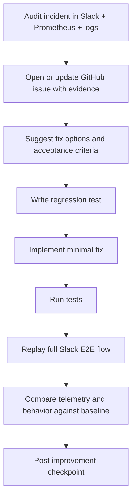

# When Your AI Agents Run Your Day, Who Watches The Agents?

**A 3-part series on building observable, auditable multi-agent systems — and letting the coding agent itself be the auditor.**

*By Hugo Evers — FateForger*

---

## Series Context

If you're running AI agents in production — scheduling patient workflows, orchestrating lab operations, coordinating clinical trial logistics — you don't get to say "we think it's working." You need telemetry. You need audit trails. You need to prove what happened, why, and whether it was correct.

FateForger is a multi-agent productivity system (AutoGen + Slack + Google Calendar + Notion) that orchestrates daily planning through conversational AI. It does constraint extraction, calendar patching, quality scoring, and iterative refinement — all through staged agent pipelines.

The real story isn't the agents. It's the infrastructure that lets a *general-purpose coding agent* — the same Copilot sitting in your IDE — independently audit the entire system on your behalf. Metrics, logs, Slack conversations, all queryable through tool calls. No dashboards to stare at. No log files to grep manually. The agent does it.

This is relevant to anyone building regulated, high-stakes AI systems — where "it seems fine" doesn't cut it.

---

# Part I: What FateForger Actually Is (And Why It Needs An Observability Spine)

## The Problem With Agentic Systems

When a single LLM call goes wrong, you get a bad answer. When a *pipeline of agents* goes wrong — where Agent A extracts constraints, Agent B drafts a plan, Agent C patches a calendar, and Agent D scores quality — you get a cascade failure that looks like correct behavior. The schedule renders. The Slack message is polished. But 161 constraints silently accumulated from shared-scope memory, and nobody noticed until a user asked "why does it say 167?"

That's a real incident from a FateForger session. It took 4 minutes to diagnose — not because the system was well-designed from the start, but because the observability infrastructure existed to answer the question mechanically.

## What FateForger Is

FateForger is an agentic productivity system built on [AutoGen](https://github.com/microsoft/autogen) (Microsoft's multi-agent framework). It lives in Slack, talks to your Google Calendar, remembers your preferences in Notion, and runs planning workflows through a staged pipeline.

The core loop:

1. **You say** "let's plan today" in Slack
2. **Stage 1** extracts your constraints (meetings, energy preferences, commute times) from conversation + durable memory
3. **Stage 2** captures your inputs for the day (tasks, priorities, deadlines)
4. **Stage 3** drafts a schedule skeleton
5. **Stage 4** iteratively refines via LLM-driven patching: diff → score → patch → re-score
6. **Stage 5** reviews and commits to your calendar

Each stage is a node in a `GraphFlow` DAG (AutoGen's declarative state machine). Each transition is conditional. Each LLM call is instrumented. Each tool invocation is counted.

```
┌──────────────────────────────────────────────────────────────────────────┐
│                     FateForger Stage Pipeline                            │
│                                                                          │
│  ┌──────────┐   ┌────────────┐   ┌──────────────┐   ┌───────────────┐  │
│  │ Stage 1  │──▶│  Stage 2   │──▶│   Stage 3    │──▶│   Stage 4     │  │
│  │ Extract  │   │  Capture   │   │   Skeleton   │   │   Refine      │  │
│  │Constraints│  │  Inputs    │   │   Draft      │   │ Patch→Score→  │  │
│  │          │   │            │   │              │   │ Patch→Score   │  │
│  └──────────┘   └────────────┘   └──────────────┘   └──────┬────────┘  │
│                                                             │           │
│                                                    ┌────────▼────────┐  │
│                                                    │    Stage 5      │  │
│                                                    │ Review + Commit │  │
│                                                    │  → Calendar     │  │
│                                                    └─────────────────┘  │
│                                                                          │
│  Each stage:                                                             │
│  • Emits Prometheus counters (calls, tokens, errors, latency)           │
│  • Writes structured JSON session events                                 │
│  • Sanitized LLM I/O audit trail (request shape + response metadata)    │
└──────────────────────────────────────────────────────────────────────────┘
```

## Why This Matters For Regulated / High-Stakes Domains

If you're building AI that touches patient schedules, lab workflows, or clinical operations — the same architectural challenges apply with higher stakes:

- **Constraint accumulation**: shared-scope preferences silently growing across sessions
- **Counter semantics**: "6 extracted" ≠ "6 active" — two numbers that look like the same metric but aren't
- **Silent cascades**: one stage produces valid-looking output from corrupted input
- **Calendar/external system writes**: irreversible actions based on stale or inflated state

You can't unit-test your way out of these. You need runtime observability with enough structure that an automated auditor can reconstruct what happened.

And this now explicitly includes commit-path behavior: first-submit vs re-submit, duplicate detection outcomes, and whether user intent ("commit now") matched the stage state at execution time.

## The Instrumentation Surface

FateForger emits seven Prometheus metric families:

```
┌───────────────────────────────────────────────────────────────────┐
│                    Prometheus Metrics                              │
├───────────────────────────────────┬───────────────────────────────┤
│ fateforger_llm_calls_total        │ Every LLM invocation          │
│   labels: agent, model, status,   │ by agent, purpose, outcome   │
│   call_label, function             │                               │
├───────────────────────────────────┼───────────────────────────────┤
│ fateforger_llm_tokens_total       │ Token spend by model +        │
│   labels: agent, model, type,     │ prompt vs completion          │
│   call_label, function             │                               │
├───────────────────────────────────┼───────────────────────────────┤
│ fateforger_tool_calls_total       │ MCP tool call outcomes         │
│   labels: agent, tool, status      │                               │
├───────────────────────────────────┼───────────────────────────────┤
│ fateforger_errors_total           │ Errors by component + type     │
│   labels: component, error_type    │                               │
├───────────────────────────────────┼───────────────────────────────┤
│ fateforger_stage_duration_seconds │ Stage latency histogram        │
│   labels: stage                    │ (50ms → 120s buckets)         │
├───────────────────────────────────┼───────────────────────────────┤
│ fateforger_observability_         │ Audit pipeline self-health     │
│   dropped_events_total            │ (queue overflow detection)     │
├───────────────────────────────────┼───────────────────────────────┤
│ fateforger_admonishments_total    │ Follow-up/reminder actions     │
│   labels: component, event, status │                               │
└───────────────────────────────────┴───────────────────────────────┘
```

Plus structured JSON session logs (per-thread event sequences), patcher logs (LLM patch request/response), and a non-blocking LLM I/O audit pipeline that sinks to Loki and/or local JSONL files.

**Cardinality is enforced.** Agent names are sanitized (UUID suffixes stripped). Thread IDs and session keys are *never* metric labels — they go to logs. This is critical: high-cardinality labels in Prometheus will eventually kill your monitoring. The separation is explicit and automated.

---

# Part II: How The Observability Stack Hooks Into FateForger (And How A Coding Agent Audits It)

## The Architecture: Two Parallel Data Planes

The key insight: **metrics answer "is something wrong?" and logs answer "what exactly happened?"** These are different questions that require different storage, different query languages, and different retention policies.

FateForger doesn't try to make one system do both jobs.

```
┌─────────────────────────────────────────────────────────────────────────────┐
│                    Observability Data Flow                                   │
│                                                                             │
│  ┌──────────────────┐                                                       │
│  │   FateForger App  │                                                       │
│  │  (Python process) │                                                       │
│  └──┬─────────┬──────┘                                                       │
│     │         │                                                              │
│     │ :9464   │ JSON stdout + JSONL files                                    │
│     │ /metrics│                                                              │
│     ▼         ▼                                                              │
│  ┌──────┐  ┌─────────┐   ┌───────────────┐                                  │
│  │Prom- │  │Promtail │──▶│     Loki      │◀──┐                              │
│  │etheus│  │(scrapes │   │ (log store)   │   │                              │
│  │      │  │ Docker  │   └───────┬───────┘   │                              │
│  │      │  │ + host  │           │           │                              │
│  │      │  │  logs/) │   ┌───────▼───────┐   │                              │
│  └──┬───┘  └─────────┘   │    Grafana    │   │                              │
│     │                    │  (dashboards) │   │                              │
│     │                    └───────────────┘   │                              │
│     │                                        │                              │
│     │  ┌─────────────────┐   ┌──────────┐    │                              │
│     └─▶│  Prometheus MCP │   │ OTel     │────┘                              │
│        │  Server (stdio) │   │Collector │  (traces→Tempo, logs→Loki,        │
│        └────────┬────────┘   └──────────┘   metrics→Prometheus)             │
│                 │                                                            │
│                 ▼                                                            │
│        ┌────────────────┐                                                    │
│        │  Coding Agent   │◀──── also reads local logs/ via                   │
│        │  (Copilot/Codex)│      timebox_log_query.py CLI                     │
│        └────────────────┘                                                    │
│                                                                             │
└─────────────────────────────────────────────────────────────────────────────┘
```

### The Six Services

| Service | What It Does | Why It's There |
|---------|-------------|----------------|
| **Prometheus** | Scrapes `/metrics` from the app every 15s | Rate detection, alerting thresholds, cardinality-safe aggregation |
| **Loki** | Stores structured log streams | Payload-level diagnosis: full event sequences, LLM I/O metadata |
| **Promtail** | Scrapes Docker container stdout + host `logs/` directory | Bridges the app's file-based logging into Loki's queryable index |
| **OpenTelemetry Collector** | Receives OTLP traces, metrics, and logs | Routes traces to Tempo, metrics to Prometheus, logs to Loki |
| **Tempo** | Distributed tracing backend | Request-level trace correlation (OTLP gRPC/HTTP) |
| **Grafana** | Visualization + exploration | Two provisioned dashboards: "Timeboxing Overview" and "Timeboxing Deep Dive" |

### How The Coding Agent Connects

This is where it gets interesting. The Prometheus MCP server — running as a stdio Docker container — exposes PromQL as tool calls that any MCP-compatible coding agent can invoke:

```
┌──────────────────────────────────────────────────────────────────┐
│              Agent Audit Tool Surface                             │
│                                                                  │
│  The coding agent (Copilot, Codex, etc.) has access to:         │
│                                                                  │
│  ┌─────────────────────────────┐                                 │
│  │ Prometheus MCP Server       │                                 │
│  │  • health_check             │  "Is the system healthy?"       │
│  │  • execute_query            │  "What's the error rate?"       │
│  │  • execute_range_query      │  "Token spend over 2 hours?"   │
│  │  • list_metrics             │  "What metrics exist?"          │
│  │  • get_metric_metadata      │  "What does this counter mean?"│
│  │  • get_targets              │  "Is the scrape working?"       │
│  └─────────────────────────────┘                                 │
│                                                                  │
│  ┌─────────────────────────────┐                                 │
│  │ Local Log Query CLI         │                                 │
│  │  • sessions  (list indexed  │  "Which sessions ran today?"   │
│  │               session logs) │                                 │
│  │  • events    (query session │  "What happened in this         │
│  │               timeline)     │   thread, step by step?"        │
│  │  • llm       (query LLM    │  "What did the model see        │
│  │               I/O audit)    │   and respond?"                 │
│  │  • patcher   (query patch   │  "What edits were attempted    │
│  │               request logs) │   on the schedule?"             │
│  └─────────────────────────────┘                                 │
│                                                                  │
│  ┌─────────────────────────────┐                                 │
│  │ Slack MCP / Driver Script   │                                 │
│  │  • Post messages as user    │  "Reproduce the scenario"       │
│  │  • Read thread history      │  "What did the user see?"       │
│  │  • Capture thread_ts        │  "Correlate to session logs"    │
│  └─────────────────────────────┘                                 │
└──────────────────────────────────────────────────────────────────┘
```

### The Audit Loop In Practice

Here's what actually happens when someone reports an anomaly. This is a real workflow, not a demo:

```
┌─────────────────────────────────────────────────────────────────────────────┐
│                   Two-Phase Audit Protocol                                   │
│                                                                             │
│  Phase 1: DETECT (Prometheus — seconds)                                     │
│  ┌───────────────────────────────────────────────────────────────┐          │
│  │ 1. up{job="fateforger_app"} → verify scrape health           │          │
│  │ 2. rate(fateforger_errors_total[5m]) → any error spikes?     │          │
│  │ 3. rate(fateforger_llm_calls_total[5m]) → call volume ok?    │          │
│  │ 4. fateforger_tool_calls_total{status!="ok"} → tool fails?   │          │
│  │ 5. histogram_quantile(0.95, ...) → latency outliers?         │          │
│  └───────────────────────────────────────────────────────────────┘          │
│                           │                                                 │
│                           │ anomaly detected                                │
│                           ▼                                                 │
│  Phase 2: DIAGNOSE (Logs — minutes)                                         │
│  ┌───────────────────────────────────────────────────────────────┐          │
│  │ 1. Map thread_ts → session_key                                │          │
│  │ 2. timebox_log_query.py events --session-key <key>           │          │
│  │    → full stage progression with exact counters               │          │
│  │ 3. timebox_log_query.py llm --session-key <key>              │          │
│  │    → what the model saw and responded per call_label          │          │
│  │ 4. Loki queries for cross-session correlation                 │          │
│  │    {service="fateforger",source="llm_io"} | json             │          │
│  │ 5. Root cause identified with counter-level evidence          │          │
│  └───────────────────────────────────────────────────────────────┘          │
│                                                                             │
│  Time to diagnosis: typically 2–5 minutes for known failure patterns        │
│  Agent does this autonomously — no human log-grepping required              │
└─────────────────────────────────────────────────────────────────────────────┘
```

### What We Can Audit Now (Expanded Surface)

Because the stack is now wired across Slack + metrics + structured logs + patcher diagnostics, the coding agent can audit:

- Constraint inflation mechanics: `local_count`, shared-scope totals, active totals, selected/dropped counts.
- Stage transition correctness: whether "commit now" in `Refine` became a transition vs immediate submit.
- Submit-path semantics: first submit vs re-submit, operation mix, duplicate failures, and `partial_halted` causes.
- Delivery vs compute failures: Slack timeout text vs confirmed `graph_turn_end` completion in logs.
- Patcher churn: repeated patcher calls, where they occur, and whether they converged or thrashed.

### A Real Example: The "167 Constraints" Incident

A user asked: *"Why does it say 167 active constraints?"*

The coding agent's audit path:

1. **Prometheus**: `up == 1`, error rate `0` — system healthy, not a crash
2. **Log query**: `sessions --limit 5` → found session `1772663759.082919`
3. **Events**: `events --session-key 1772663759.082919` → saw `active_count: 167 → extracted_count: 6 → active_count: 173`
4. **Diagnosis**: The 6 newly extracted constraints were *added* to 167 pre-existing shared-scope constraints. The UI was showing "newly extracted" as if it were the total.
5. **Root cause**: Counter interpretation mismatch + shared-scope accumulation. Not a bug in extraction — a bug in presentation semantics.

Total time: ~4 minutes. The agent filed a GitHub issue with the exact log evidence, counter semantics, and proposed fix.

### Session Addendum: "Commit Now" -> `partial_halted`

In the same audit window, another incident surfaced:

- User: "yes commit it to the calendar now"
- Bot: `Submission finished with status partial_halted.`

What the logs proved:

1. The session already had an earlier successful submit (`status=committed`, `created=13`).
2. The later "commit now" message was sent while still in `Refine`.
3. The flow moved to `ReviewCommit` and attempted a second submission.
4. The second submit hit duplicate-create errors (for example `Lunch already exists`) and, with `halt_on_error=True`, returned `partial_halted`.

So this was not an initial commit failure; it was a re-submit/idempotency and UX-semantics gap.

Follow-up issue:
- https://github.com/hugocool/FateForger/issues/71

**That's the pitch.** Not "we have dashboards." Not "we write logs." The coding agent sitting in your IDE can independently reconstruct any system event chain, diagnose root causes, and file issues — using the same infrastructure that runs in production.

---

# Part III: Talking To The Workflow Agents Through Slack (Agent-Auditing-Agent)

## The Third Data Surface: Slack As An Operator Console

Prometheus tells you *if* something is wrong. Logs tell you *what* happened. But sometimes you need to know *what the user actually experienced* — and reproduce it.

FateForger's agents live in Slack. The user talks to them in threads. The agents respond with structured cards, schedule previews, and iterative refinements. The operational truth of the system is the Slack conversation.

So the coding agent can talk to them too.

```
┌─────────────────────────────────────────────────────────────────────────────┐
│               Slack-First Audit Architecture                                 │
│                                                                             │
│  ┌──────────────┐     ┌───────────────────┐     ┌───────────────────────┐  │
│  │  Coding Agent │     │   Slack MCP /      │     │  FateForger Agents    │  │
│  │  (Copilot)    │────▶│   Driver Script    │────▶│  (in Slack threads)   │  │
│  │               │     │                   │     │                       │  │
│  │  "Send:       │     │  Posts message as  │     │  ┌─────────────────┐ │  │
│  │   'plan my    │     │  real user in the  │     │  │ TaskMarshal     │ │  │
│  │    day'"      │     │  target channel    │     │  │ (routing/intake)│ │  │
│  │               │     │                   │     │  ├─────────────────┤ │  │
│  │  Captures:    │     │  Returns:          │     │  │ Timeboxing Flow │ │  │
│  │  • thread_ts  │     │  • thread_ts      │     │  │ (staged planner)│ │  │
│  │  • responses  │     │  • message bodies │     │  ├─────────────────┤ │  │
│  │  • block data │     │                   │     │  │ Schedular       │ │  │
│  └──────┬───────┘     └───────────────────┘     │  │ (calendar sync) │ │  │
│         │                                        │  ├─────────────────┤ │  │
│         │  correlate                             │  │ Admonisher      │ │  │
│         │  thread_ts → session_key               │  │ (follow-ups)    │ │  │
│         │                                        │  └─────────────────┘ │  │
│         ▼                                        └───────────────────────┘  │
│  ┌──────────────┐                                                           │
│  │ Prometheus +  │  Metrics for this session                                │
│  │ Session Logs  │  Events for this thread_ts                               │
│  │              │  LLM I/O for each stage gate                              │
│  └──────────────┘                                                           │
│                                                                             │
│  Result: the coding agent can drive a full user scenario,                   │
│  observe what the agents did internally, and compare                        │
│  user-visible output against system-level telemetry.                        │
└─────────────────────────────────────────────────────────────────────────────┘
```

## Two Ways In: Slack MCP and User Driver

**Slack MCP** is a Model Context Protocol server that wraps the Slack API. The coding agent calls tools like `send_message`, `read_thread`, `list_channels` — and Slack treats it like any other API client. The agent can post messages, read responses, and interact with Slack action buttons (confirm/deny/undo).

**User Driver** (`slack_user_timeboxing_driver.py`) is the fallback: a Python script that uses a real user token (`xoxp-...`) to post messages in target threads. This exercises the exact same inbound path that a human user would trigger — critical for testing because it verifies the full Slack event routing, not just the agent API.

### The Audit Sequence

```
┌─────────────────────────────────────────────────────────────────────────────┐
│              End-to-End Audit Conversation                                    │
│                                                                             │
│   Coding Agent                     Slack                    FateForger       │
│   (in IDE)                         Thread                   Backend          │
│       │                              │                          │            │
│       │──── send "plan my day" ─────▶│                          │            │
│       │                              │──── event routed ───────▶│            │
│       │                              │                          │            │
│       │                              │◀─── Stage 1 response ───│            │
│       │                              │     (constraint summary) │            │
│       │◀──── read response ─────────│                          │            │
│       │                              │                          │            │
│       │──── send task details ──────▶│                          │            │
│       │                              │──── event routed ───────▶│            │
│       │                              │                          │            │
│       │                              │◀─── Stage 3 response ───│            │
│       │                              │     (schedule draft)     │            │
│       │◀──── read response ─────────│                          │            │
│       │                              │                          │            │
│       │                              │                     ┌────┴────┐       │
│       │          meanwhile...        │                     │ Session │       │
│       │                              │                     │  Logs   │       │
│       │──── query prometheus ──────────────────────────────▶│ Metrics │       │
│       │◀──── error_rate = 0  ──────────────────────────────│         │       │
│       │                              │                     │         │       │
│       │──── query session events ──────────────────────────▶│         │       │
│       │◀──── stage progression  ───────────────────────────│         │       │
│       │      active_count: 42        │                     └─────────┘       │
│       │      quality_score: 3        │                          │            │
│       │                              │                          │            │
│       │──── VERDICT: ────────────────│                          │            │
│       │  "Stage 3 produced correct   │                          │            │
│       │   skeleton. 42 constraints   │                          │            │
│       │   active (expected). Score 3 │                          │            │
│       │   triggered Stage 4 loop.    │                          │            │
│       │   No anomalies detected."    │                          │            │
│       │                              │                          │            │
└─────────────────────────────────────────────────────────────────────────────┘
```

## Why Agent-Auditing-Agent Matters

### 1. Reproducibility Without Human Labor

Traditional approach: a QA engineer manually sends Slack messages, screenshots the responses, greps log files, cross-references timestamps, writes up a report.

Our approach: the coding agent does all of that in a single tool-call sequence. It can reproduce any user scenario, correlate to backend telemetry, and produce a structured diagnosis — in the time it takes a human to open the log file.

### 2. Continuous Regression Detection

After every code change, the coding agent can:
- Drive a standard timeboxing conversation through Slack
- Verify all 5 stages complete correctly
- Check that constraint counts, quality scores, and calendar writes match expectations
- Compare latency and token spend against baselines
- File issues if anything regresses

This isn't a test suite (though those exist too). It's a *live system audit* against the real Slack + Calendar + Notion integration stack.

### 2b. From Functional Tests to True E2E Remediation

The practical upgrade is that testing is no longer only functional or mocked integration checks. The coding agent can run the full operator loop:



In short: `audit -> issue -> suggest fix -> write test -> implement -> run tests -> e2e -> verify improvement`.

### 3. The Compliance Angle

For anyone building AI in regulated domains: imagine being able to say *"our coding agent independently audits every workflow run, correlates user-visible behavior to internal telemetry, and produces structured evidence of correct operation."*

That's not a dashboard someone might look at. It's an automated verification loop with full provenance.

## The Full Picture

```
┌─────────────────────────────────────────────────────────────────────────────┐
│            Complete FateForger Observability Architecture                     │
│                                                                             │
│  USER PLANE                                                                  │
│  ┌────────────────────────────────────────────────────────────┐              │
│  │  Slack Workspace                                           │              │
│  │  ┌──────────────┐  ┌──────────────┐  ┌──────────────┐    │              │
│  │  │ #planning     │  │ #timeboxing  │  │ DMs          │    │              │
│  │  │ channel       │  │ threads      │  │              │    │              │
│  │  └──────┬───────┘  └──────┬───────┘  └──────┬───────┘    │              │
│  └─────────┼─────────────────┼─────────────────┼────────────┘              │
│            │                 │                 │                             │
│  AGENT PLANE                 │                 │                             │
│  ┌─────────┼─────────────────┼─────────────────┼────────────┐              │
│  │         ▼                 ▼                 ▼             │              │
│  │  ┌─────────────┐  ┌─────────────┐  ┌─────────────┐      │              │
│  │  │ TaskMarshal  │  │ Timeboxing  │  │ Admonisher  │      │              │
│  │  │ (router)     │  │ (GraphFlow) │  │ (follow-up) │      │              │
│  │  └──────┬──────┘  └──────┬──────┘  └─────────────┘      │              │
│  │         │                │                                │              │
│  │         │         ┌──────▼──────┐                         │              │
│  │         │         │  Schedular   │                         │              │
│  │         │         │ (cal sync)   │───▶ Google Calendar    │              │
│  │         │         └─────────────┘                         │              │
│  │         │                │                                │              │
│  │         │         ┌──────▼──────┐                         │              │
│  │         │         │ Constraint  │                         │              │
│  │         │         │ Memory      │───▶ Notion              │              │
│  │         │         └─────────────┘                         │              │
│  └─────────┼────────────────┼───────────────────────────────┘              │
│            │                │                                               │
│  TELEMETRY PLANE            │ emits                                         │
│  ┌─────────┼────────────────┼───────────────────────────────┐              │
│  │         │         ┌──────▼──────┐                         │              │
│  │         │         │ Counters    │──▶ Prometheus ──▶ MCP   │              │
│  │         │         │ Histograms  │                  Server │              │
│  │         │         ├─────────────┤                    │    │              │
│  │         │         │ JSON Events │──▶ Loki      │    │    │              │
│  │         │         │ LLM I/O     │   (Promtail) │    │    │              │
│  │         │         ├─────────────┤              │    │    │              │
│  │         │         │ OTLP Traces │──▶ Tempo     │    │    │              │
│  │         │         └─────────────┘   (OTel)     │    │    │              │
│  │         │                                ┌─────▼────▼──┐ │              │
│  │         │                                │   Grafana    │ │              │
│  │         │                                └─────────────┘ │              │
│  └─────────┼────────────────────────────────────────────────┘              │
│            │                                      │                         │
│  AUDIT PLANE                                      │                         │
│  ┌─────────┼──────────────────────────────────────┼─────────┐              │
│  │         │                                      │          │              │
│  │  ┌──────▼──────┐   ┌──────────────┐    ┌──────▼──────┐  │              │
│  │  │ Slack MCP /  │   │ Log Query    │    │ Prom MCP    │  │              │
│  │  │ User Driver  │   │ CLI          │    │ Server      │  │              │
│  │  └──────┬──────┘   └──────┬───────┘    └──────┬──────┘  │              │
│  │         │                 │                    │          │              │
│  │         └─────────────────┼────────────────────┘          │              │
│  │                           │                               │              │
│  │                    ┌──────▼──────┐                        │              │
│  │                    │ Coding Agent │                        │              │
│  │                    │ (Copilot /   │                        │              │
│  │                    │  Codex)      │                        │              │
│  │                    └─────────────┘                        │              │
│  └──────────────────────────────────────────────────────────┘              │
│                                                                             │
│  Four planes. Three data surfaces. One agent that can traverse all of them. │
└─────────────────────────────────────────────────────────────────────────────┘
```

## What's Next

The system works today. The coding agent can audit FateForger sessions, diagnose root causes, and file structured issues — all through tool calls. But there are clear next steps:

- **Automated regression harness**: run a standard audit conversation after every deploy, compare against baseline metrics, gate on regressions
- **Cross-session drift detection**: Prometheus range queries over days to detect constraint accumulation trends or token spend creep
- **Compliance-ready audit reports**: structured markdown artifacts with full evidence chains, suitable for regulatory review
- **Multi-agent coordination audits**: as more agents come online (TaskMarshal, Schedular, Admonisher), the audit surface needs to verify handoff semantics — did the right agent get the right message, and did it produce the right output?

The infrastructure is deliberate. The separation between detection (metrics) and diagnosis (logs) is deliberate. The MCP bridge from coding agent to Prometheus is deliberate. The ability to talk to the same agents the user talks to — through the same Slack surface — is deliberate.

If you're building agentic systems for serious domains, you need this kind of observability. Not because regulators ask for it (though they will). Because without it, you're guessing whether your agents are doing the right thing.

And guessing is not an operating model.

---

*Hugo Evers builds FateForger — an agentic productivity system that takes planning seriously enough to make it observable. If you're working on multi-agent systems in life sciences, clinical operations, or any domain where "it probably works" isn't good enough — [reach out](https://github.com/hugocool/FateForger).*
