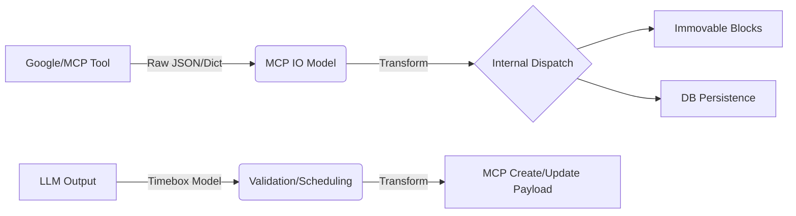
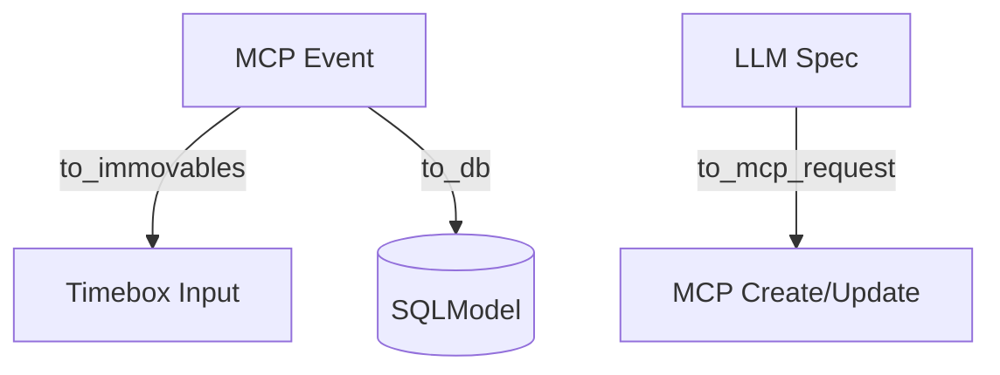

## 📋 Overview

Currently, Google Calendar MCP integration relies on ad-hoc dictionary probing and inconsistent JSON extraction across `reconcile.py`, `agent.py`, and `mcp_clients.py`. This fragmentation causes silent failures in timeboxing and makes the system brittle to schema changes.

**Goal:** Establish a 3-layer modeling architecture (MCP IO ↔ LLM Schema ↔ Domain/DB) with explicit transformation logic.

---

## 🔍 Current State Audit

> **The Problem:** We have 3+ "CalendarEvent-ish" models that don't talk to each other, leading to "Triple-Duty" models (e.g., SQLModels acting as LLM schemas).
> 

### 1. Fragmented Logic

- **Dict Probing:** `reconcile.py` and `agent.py` use different logic to find `events` vs `items`.
- **Inconsistent Decoding:** Some helpers expect JSON strings; others expect pre-decoded dicts.
- **Stale Docs:** `readme.md` references non-existent files (`calendar_contract.py`).

### 2. Conflicting Models

| **Model Location** | **Purpose** | **Constraints** |
| --- | --- | --- |
| `contracts.py` | Lightweight API DTO | Used only by `diffing_agent.py`. |
| `calendar.py` | SQLModel / DB | Used for persistence; rigid `extra="forbid"` settings. |
| `messages.py` | Slack/Runtime DTO | Uses strings for start/end; specific to upserts. |

---

## 🏗️ Proposed Architecture

We are moving away from a "one-size-fits-all" model to a dedicated **Transform Pipeline**:

### The 3-Layer Strateg

1. **MCP IO Layer:** Pydantic models matching Google/MCP server payloads. Handles "all-day" vs "timed" logic and `events`/`items` keys.
2. **LLM Schema Layer:** Token-optimized "Event Specs" (ST/ET/DT) for prompts. Minimalist and clear descriptions.
3. **Domain/DB Layer:** SQLModels focused on persistence and relationships.

### Data Flow Logic

---

## 🎯 Acceptance Criteria

- [ ]  **Unified Parsing:** A single entry point for MCP `list-events` results (no `dict.get()` in agents).
- [ ]  **Deterministic Mapping:** Clear rules for converting RFC3339/ISO strings into `Immovable` rows for timeboxing.
- [ ]  **Output Reliability:** `Timebox` objects convert to MCP-compatible payloads without manual string formatting.
- [ ]  **Test Coverage:** Unit tests for JSON decoding, "all-day" event spans, and cancelled event filtering.

---

## 🛠️ Implementation Plan

### 1. New Module Layout

- `models/mcp/calendar.py`: IO Models.
- `models/llm/timebox.py`: LLM-facing schemas.
- `mappings/calendar_transforms.py`: The "glue" functions.

### 2. The Transforms

---

## ❓ Scope Questions (Immediate Input Needed)

> [!WARNING]
> 
> 
> Please clarify these three points so we can finalize the model definitions:
> 
1. **Payload Format:** Does the MCP server expect nested `{dateTime: "...", timeZone: "..."}` (Google V3) or flat strings (RFC3339)?
2. **All-Day Logic:** Do we map all-day events to `00:00 -> 24:00` or ignore them for scheduling purposes?
3. **Strictness:** Should `event_type` (DEEP_WORK, etc.) be a required field for the LLM, or do we allow a default fallback?