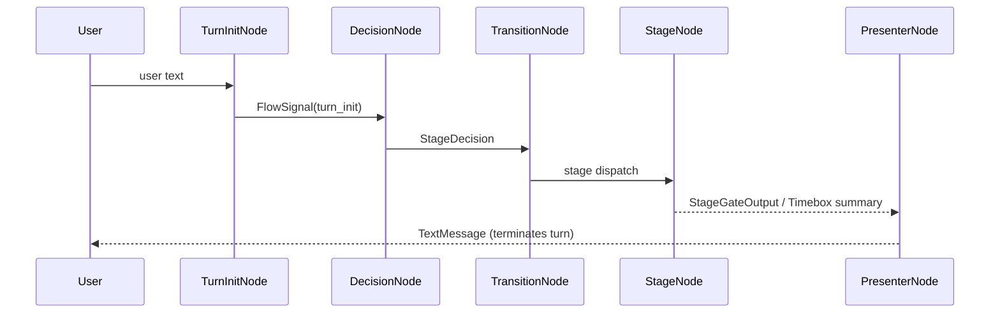
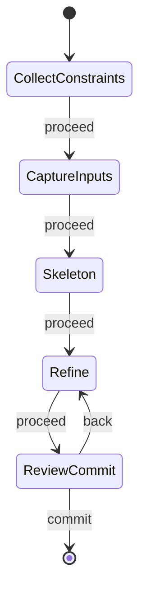
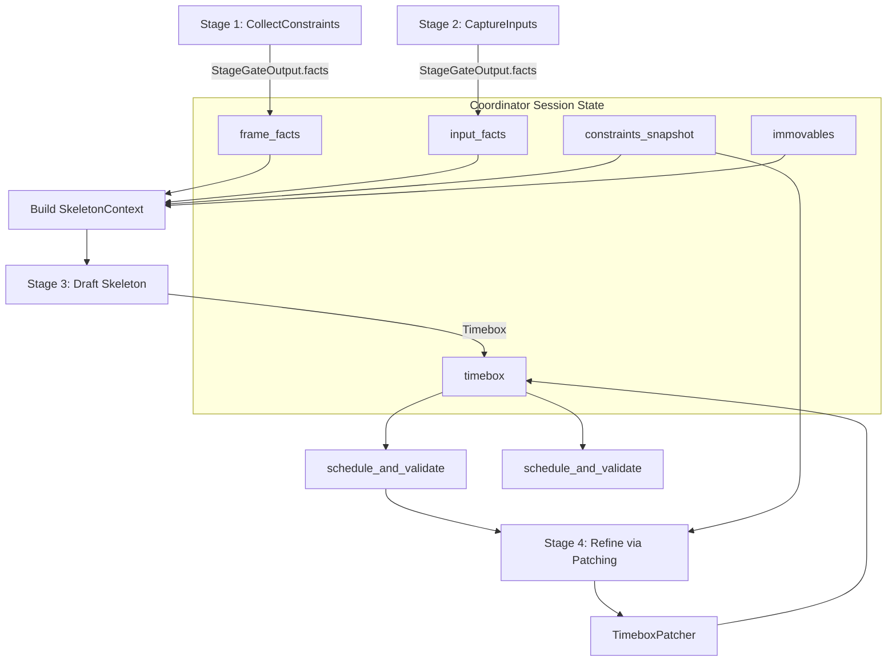
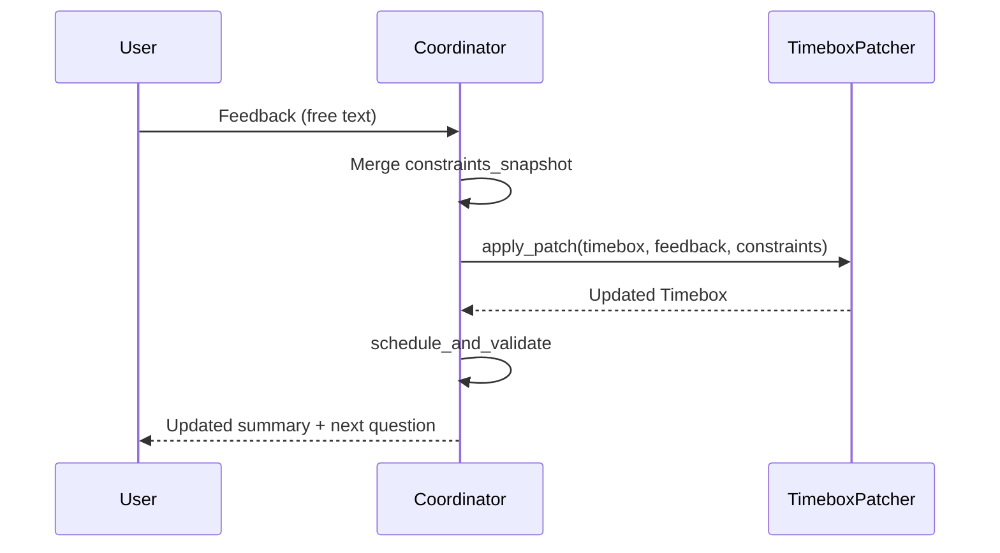

# Timeboxing Agent

Stage-gated timeboxing workflow that builds daily schedules.

Key files:
- `agent.py`: orchestration and stage gating (coordinator).
- `flow_graph.py`: AutoGen GraphFlow state machine (single source of truth for stage transitions).
- `nodes/nodes.py`: GraphFlow node agents (Decision/Transition/Stages/Presenter).
- `stage_gating.py`: stage schema + stage-gate prompts (LLM-only, JSON I/O).
- `contracts.py`: typed stage context contracts (what each stage receives).
- `skeleton_draft_system_prompt.j2`: single-purpose skeleton drafting system prompt template.
- `prompt_rendering.py`: Jinja renderer for skeleton drafting.
- `timebox.py`: timebox schema + `schedule_and_validate` (token-saver).
- `patching.py`: patch-based refinement (single mutation path).
- `mcp_clients.py`: internal MCP clients (calendar + constraint memory).
- `constants.py`: orchestration timeouts/limits (no magic numbers).
- `pydantic_parsing.py`: tolerant parsing helpers for LLM outputs and mixed payloads.
- `nlu.py`: multilingual structured parsing (planned date + constraint interpretation).
- `preferences.py`: session constraint store.
- `notion_constraint_extractor.py`: durable constraint extraction.

See `AGENTS.md` in this folder for operational rules.

## Architecture (Spec)

The timeboxing implementation is organized as a coordinator + a small set of single-purpose stage agents.

- **Coordinator**: owns session state, merges facts/constraints, runs background tool work (calendar, Notion), and decides which stage runs next.
- **Stage agents**: pure functions over typed JSON input that return typed JSON output.
- **Timebox model**: validates and fills in times so the LLM can emit minimal schedules.
- **Patching**: updates an existing `Timebox` rather than rewriting it.
- **GraphFlow**: runs the stage machine as a directed graph, making transitions testable and explicit.

### GraphFlow State Machine

Implementation:

- Graph builder: `src/fateforger/agents/timeboxing/flow_graph.py`
- Node agents: `src/fateforger/agents/timeboxing/nodes/nodes.py`

Design notes:

- GraphFlow edges default to `activation_condition="all"` for multi-parent nodes. Nodes like `PresenterNode` must use `activation_condition="any"` on incoming edges, otherwise the graph can terminate early without producing output.
- A single Slack/user turn runs the graph until `PresenterNode` emits a `TextMessage`, then stops via `TextMessageTermination(source="PresenterNode")`.

#### GraphFlow Turn Sequence

### Prompt Injection (TOON tables)

List-shaped structured data (constraints, tasks, immovables, events) is injected into stage prompts using TOON tabular format rather than JSON arrays.

- Encoder: `src/fateforger/llm/toon.py` (`toon_encode`)
- Timeboxing-specific “views” (minimal columns): `src/fateforger/agents/timeboxing/toon_views.py`
- Skeleton prompt template consumes TOON tables: `src/fateforger/agents/timeboxing/skeleton_draft_system_prompt.j2`

### Session State (Coordinator-Owned)

`Session` lives in `src/fateforger/agents/timeboxing/agent.py` and is the single source of truth for:

- `frame_facts`: day frame (date/timezone, work window, sleep target, commutes, immovables)
- `input_facts`: block plan + goals/tasks (block-based; per-task durations optional)
- `durable_constraints_by_stage` + `active_constraints`: merged into a `constraints_snapshot` by the coordinator
- `timebox`: the current draft `Timebox` (Stage 3+)

### Stage Contracts

Stages and their typed outputs:

- **Stage 1 — CollectConstraints**: returns `StageGateOutput` (frame facts + missing + question)
- **Stage 2 — CaptureInputs**: returns `StageGateOutput` (block plan + tasks/goals + missing + question)
- **Stage 3 — Skeleton**: returns `Timebox` (minimal schedule; immovables + blocks)
- **Stage 4 — Refine**: applies JSON patching to update `Timebox` from user feedback + constraints
- **Stage 5 — ReviewCommit**: returns `StageGateOutput` (final review + approval question)

### Multilingual Natural Parsing (Structured LLM Output)

Deterministic, English-only string parsing is intentionally avoided for:

- planned date inference
- constraint scope inference

Instead, the coordinator uses structured LLM outputs (Pydantic) from:

- `src/fateforger/agents/timeboxing/nlu.py`

This keeps the behavior consistent across languages and reduces brittle keyword/regex parsing.

### Calendar Meetings (Immovables)

Calendar events are fetched via the MCP calendar server and normalized into `immovables` records:

- Each immovable has a fixed `start` and `end` and must be treated as non-overridable unless the user explicitly changes it.
- Skeleton drafting must include immovables first (as anchors), then fill gaps with deep/shallow work blocks.

Implementation:

- Prefetch: `src/fateforger/agents/timeboxing/agent.py` (`_prefetch_calendar_immovables`)
- Normalization: `src/fateforger/agents/timeboxing/mcp_clients.py` (`McpCalendarClient.list_day_immovables`)
- Session merge: `src/fateforger/agents/timeboxing/agent.py` (`_apply_prefetched_calendar_immovables`)

### Token-Saving Scheduling Semantics

The `Timebox` model supports “minimal” event specs:

- duration-only or partial-time events can be scheduled using anchoring rules
- missing start/end times are filled deterministically
- overlaps are rejected

Implementation: `src/fateforger/agents/timeboxing/timebox.py` (`Timebox.schedule_and_validate`).

### Patching (Single Mutation Path)

User feedback should update the schedule via the patcher rather than re-drafting:

- `TimeboxPatcher` takes the existing `Timebox` plus a user message + constraints and returns an updated `Timebox`.

Implementation: `src/fateforger/agents/timeboxing/patching.py`.

## Diagrams (Mermaid)

### State Machine

### Dataflow (Context → Typed Output)

### Patch Loop

